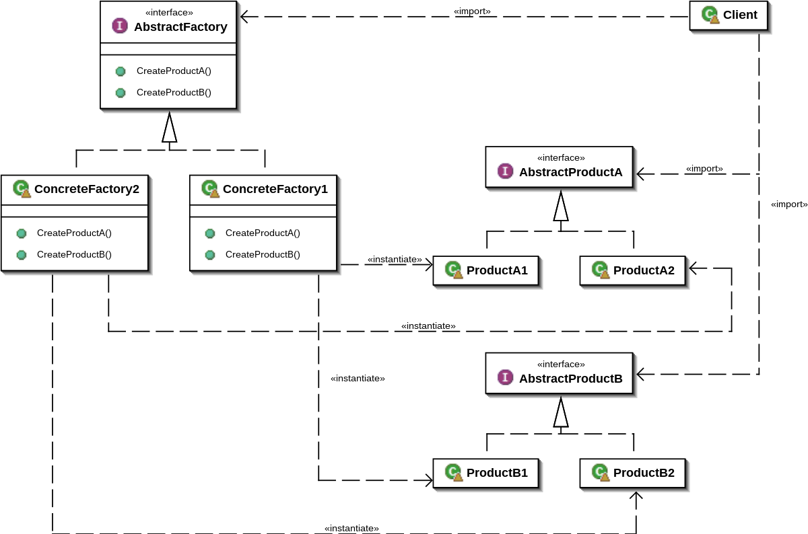

## Абстрактная фабрика (Abstract Factory)

Паттерн Abstract Factory относится к порождающим паттернам уровня объекта.

Паттерн Abstract Factory предоставляет общий интерфейс для создания семейства взаимосвязанных объектов. Это позволяет отделить функциональность системы от внутренней реализации каждого класса, а обращение к этим классам становится возможным через абстрактные интерфейсы.

Для реализации этого паттерна на описаном примере требуется:

1. Класс абстрактной фабрики CarsFactory, описывающий общий интерфейс фабрики, от которой будет наследоваться каждая конкретная фабрика;
2. Класс абстрактных продуктов Sedan и Coupe, описывающий общий интерфейс продукта, от которого будет наследоваться каждый конкретный продукт;
3. Класс конкретных фабрик FordFactory и LadaFactory;
4. Класс конкретных продуктов FordSedan и LadaSedan.
5. Класс конкретных продуктов FordCoupe и LadaCoupe.

Подведем итог.

Абстрактная фабрика представляет собой базовый класс, описывающий интерфейс конкретных фабрик, создающих продукты. Производные от него классы конкретных фабрик, должны реализовать этот интерфейс.