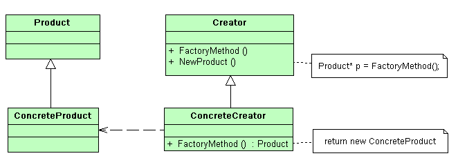

## Фабричный метод (FactoryMethod)

Паттерн Factory Method относится к порождающим паттернам уровня класса и сфокусирован только на отношениях между классами.

Паттерн Factory Method полезен, когда система должна оставаться легко расширяемой путем добавления объектов новых типов. Этот паттерн является основой для всех порождающих паттернов и может легко трансформироваться под нужды системы. По этому, если перед разработчиком стоят не четкие требования для продукта или не ясен способ организации взаимодействия между продуктами, то для начала можно воспользоваться паттерном Factory Method, пока полностью не сформируются все требования.

Паттерн Factory Method применяется для создания объектов с определенным интерфейсом, реализации которого предоставляются потомками. Другими словами, есть базовый абстрактный класс фабрики, который говорит, что каждая его наследующая фабрика должна реализовать такой-то метод для создания своих продуктов.

Реализация фабричного метода может быть разной, в большинстве случаем это зависит от языка реализации. Это может быть полиморфизм или параметризированный метод.

Для реализации этого паттерна на описаном примере требуется:

1. Базовый абстрактный класс Creator, описывающий интерфейс, который должна реализовать конкретная фабрика для производства продуктов. Этот базовый класс описывает фабричный метод.
2. Базовый класс Product, описывающий интерфейс продукта, который возвращает фабрика. Все продукты возвращаемые фабрикой должны придерживаться единого интерфейса.
3. Класс конкретной фабрики по производству продуктов ConcreteCreator. Этот класс должен реализовать фабричный метод;
4. Класс реального продукта ConcreteProductA;
5. Класс реального продукта ConcreteProductB;
6. Класс реального продукта ConcreteProductC.

Подведем итог.

Паттерн Factory Method применяется для создания объектов с определенным интерфейсом, реализации которого предоставляются потомками. Другими словами, есть базовый абстрактный класс фабрики, который говорит, что каждая его наследующая фабрика должна реализовать такой-то метод для создания своих продуктов.

